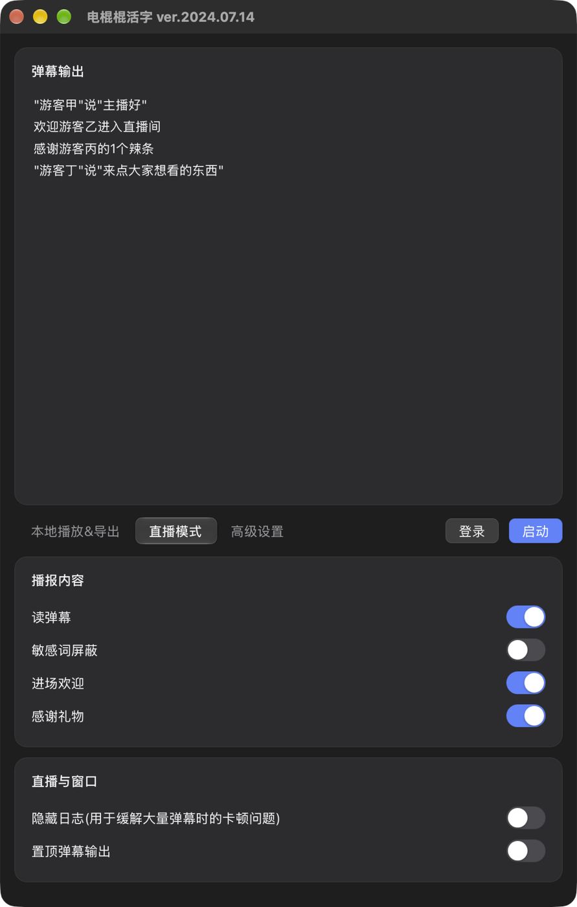

# 电棍棍活字

把 B 站直播间的弹幕、礼物、进场消息，用"鬼畜素材"一个字一个字唱出来。
本地也能直接输入文字试听、导出 wav。

<p>
  
</p>

上图是 macOS 上的新版界面（直播模式）。

作者 **襄肠**

## 功能

- **本地模式**：输入文字 → 播放 / 导出 wav，可调音调、语速、音量，
  可切换"音量统一""频音放倒""原声大碟匹配"。
- **直播模式**：读弹幕、感谢礼物、欢迎进场（各自能开关），
  支持敏感词屏蔽、隐藏日志、窗口置顶。
- **扫码登录**：二维码直接显示在窗口里，扫完自动登录，断线自动重连。

## 运行

需要 Python 3.10+；macOS 上要看到原生界面需要 macOS 26 或更新。

```bash
python3 -m venv .venv
source .venv/bin/activate          # Windows: .venv\Scripts\activate
pip install -r requirements.txt
python main.py
```

请从项目根目录启动，配置里的路径都是相对当前目录的。